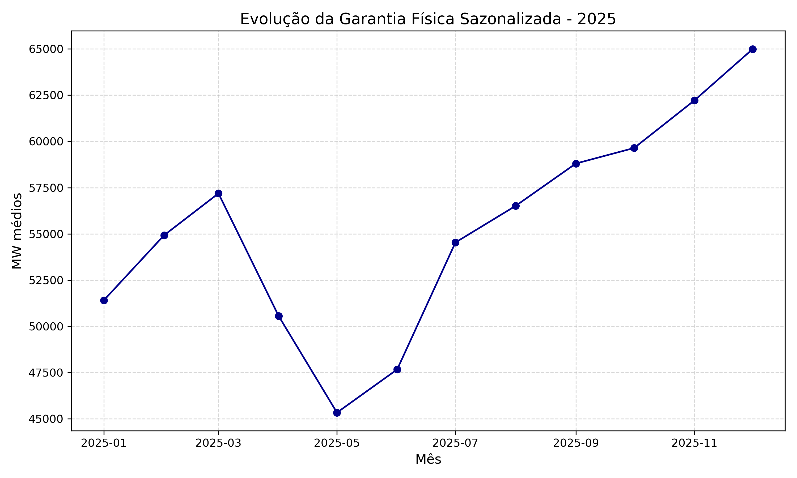
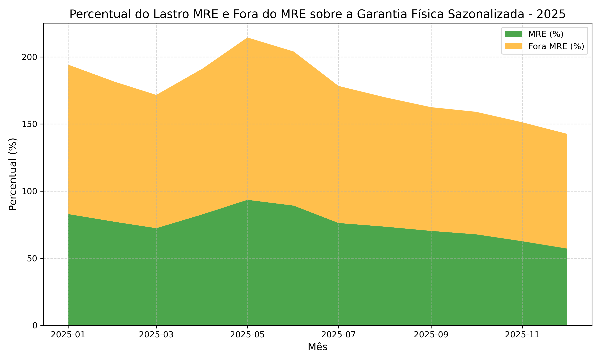

# 📊 Análise de Sazonalização e Lastro de Garantia Física no MRE (2025)

Este projeto **analisa dados de sazonalização da garantia física no MRE em 2025**, identificando a variação mensal da energia sazonalizada, o comportamento do lastro das usinas participantes e fora do MRE, apoiando previsibilidade de receita e planejamento no setor elétrico.

---

## 🎯 **Objetivos**
✅ Analisar a evolução mensal da garantia física sazonalizada em 2025.
✅ Comparar o lastro das usinas participantes do MRE vs. fora do MRE.
✅ Avaliar a representatividade percentual de MRE e fora do MRE no total sazonalizado.
✅ Gerar **gráficos claros para monitoramento e aprendizado regulatório**.

---

## ⚡ **Contexto Regulatório**

O Mecanismo de Realocação de Energia (MRE) compartilha riscos hidrológicos entre hidrelétricas, enquanto a sazonalização da garantia física modula a energia ao longo do ano, alinhando receitas e operação.

Este estudo permite entender:
🔹 A variação sazonal do lastro no ano.
🔹 A relevância do MRE na modulação do sistema.
🔹 Suporte a estratégias de comercialização e previsibilidade de caixa.

---

## **🛠️ Etapas Realizadas**

1️⃣ **Importação e limpeza de dados.**
2️⃣ **Conversão e organização das colunas.**
3️⃣ **Criação de gráficos para análise setorial:**

Evolução da garantia física sazonalizada.

Comparação do lastro MRE vs. fora do MRE.

Percentual de cada lastro em relação ao total sazonalizado.

## 📈 **Principais Gráficos**
### 📊 Evolução da Garantia Física Sazonalizada

Visualização da modulação da energia ao longo dos meses de 2025.

---

### ⚖️ Lastro MRE vs Fora do MRE

Comparação entre o lastro das usinas participantes e fora do MRE.

---

### 📊 Percentual do Lastro MRE e Fora do MRE

Demonstração da representatividade de cada componente no total sazonalizado.

## 💡 **Principais Insights**

✅ **A sazonalização mostra variação significativa ao longo do ano**, impactando previsibilidade de receita.
✅ **O MRE tem papel relevante para o sistema e mitigação de riscos hidrológicos**.
✅ Suporte para comercializadoras e geradoras planejarem modulação e fluxo de caixa.

---

## 🚀 **Próximos Passos**

🔹 Cruzar sazonalização com PLD histórico para simular receitas potenciais.
🔹 Comparar sazonalização 2025 com histórico para identificar tendências.
🔹 Desenvolver dashboards dinâmicos no Power BI ou Plotly.

---

## 🧑‍💻 **Sobre o Autor**

Este projeto faz parte do meu portfólio de Análise de Dados no Setor Elétrico, com foco em estudos aplicados e úteis para profissionais e estudantes do setor.

**Diego Juliano Lima Figueredo**
Analista de Dados e Processos | Python e Regulação no Setor Elétrico

---

## 🤝 **Contribuições**

Sugestões e colaborações são bem-vindas para expandir este estudo e contribuir com o aprendizado do setor.

---

## 📂 **Dados**

Os dados utilizados são públicos e foram extraídos do site da [CCEE]([https://www.ons.org.br/](https://dadosabertos.ccee.org.br/)).

---

## 📧 **Contato**

Conecte-se no [LinkedIn](https://www.linkedin.com/in/diego-juliano-lima-figueredo-7112816a/) para trocarmos ideias sobre dados e o setor elétrico.
